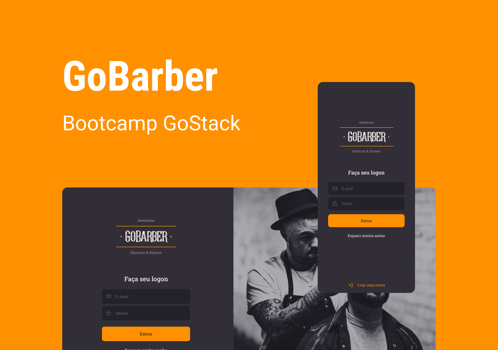

    

<h1 align="center">
    
    
 

## 🖥️ Project 🖥️
<h3>This project was be developed during a Bootcamp of RocktSeat.
    

## 🎨 Layout

    

### 🛠 Tecnologies

These are the technologies used:

- [Typescript](https://www.typescriptlang.org/)
- [Node.js](https://nodejs.org/en/) | [Express](https://expressjs.com/pt-br/)
- [React](https://reactjs.org/) | [React Native](https://reactnative.dev/)
- [Docker](https://www.docker.com/)
- [PostgreSQL](https://www.postgresql.org/) | [TypeORM](https://typeorm.io/)

